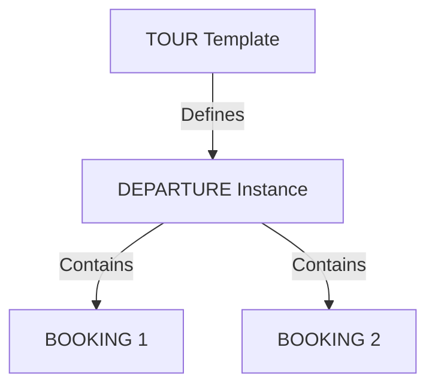

# Nevado Trek Backend - Architecture Documentation V2.0

> [!NOTE]
> **Status**: Production-Ready
> **Version**: 2.0
> **Last Updated**: November 2025

## 1. Overview

The Nevado Trek backend is a **Departure-Centric** reservation management system built on **Firebase Cloud Functions (2nd Gen)** using **Node.js 22**. It implements a refined booking logic with proper cascade effects, separated admin/public flows, and full emulator compatibility.

### Technology Stack
- **Runtime**: Node.js 22
- **Platform**: Firebase Cloud Functions (2nd Gen) on Google Cloud Run
- **Framework**: Express.js (Monolithic API pattern)
- **Database**: Firestore (NoSQL)
- **Authentication**: Header-based secret key (`X-Admin-Secret-Key`)
- **Deployment**: Automated via Firebase CLI

---

## 2. Mental Model & Concepts

### The Core Shift: From "Events" to "Departures"
In V1, "Events" mixed the concept of a "Trip Date" with a "Customer Reservation". V2.0 introduces a clean separation:

1.  **The Product: `Tour`** (Template)
    *   The catalog item (e.g., "Nevado Trek 3 Days").
    *   Defines base content, itinerary, and **Pricing Tiers**.
    *   Changes here affect *future* departures, not existing ones.

2.  **The Instance: `Departure`** (The Anchor)
    *   A specific trip happening on a specific date.
    *   **Independent of Bookings**: Can exist with 0 people (Open) or 8 people (Full).
    *   **Types**:
        *   **Public**: Open to anyone. Max 8 pax. Visible on website.
        *   **Private**: Exclusive group. Max 99 pax. Hidden.
    *   **Pricing Snapshot**: Captures the Tour's prices *at creation time*.

3.  **The Transaction: `Booking`** (Reservation)
    *   A customer securing a spot on a specific `Departure`.
    *   Must belong to a Departure.
    *   Price calculated based on Departure's snapshot.

---

## 3. Data Model

### Entity Relationship


### 1. Tours Collection (`tours`)
Master catalog of tour products.

```typescript
interface Tour {
  // Identity
  tourId: string;
  isActive: boolean;
  version: number;
  
  // Bilingual Content (es/en)
  name: { es: string, en: string };
  description: { es: string, en: string };
  shortDescription?: { es: string, en: string };
  
  // Pricing Structure (EXACTLY 4 tiers)
  pricingTiers: [
    { minPax: 1, maxPax: 1, priceCOP: number, priceUSD: number },
    { minPax: 2, maxPax: 2, priceCOP: number, priceUSD: number },
    { minPax: 3, maxPax: 3, priceCOP: number, priceUSD: number },
    { minPax: 4, maxPax: 8, priceCOP: number, priceUSD: number }
  ];
  
  // Content
  type: 'multi-day' | 'single-day';
  totalDays: number;
  itinerary?: {
    days: Array<{
      dayNumber: number;
      title: { es: string, en: string };
      activities: Array<{ es: string, en: string }>; // Paragraphs
    }>;
  };
  images?: string[];

  // Key Details
  difficulty: string;
  altitude: { es: string, en: string };
  temperature: number;
  distance: number;
  location: { es: string, en: string };
  
  // Lists
  faqs: Array<{ question: { es: string, en: string }, answer: { es: string, en: string } }>;
  recommendations: Array<{ es: string, en: string }>;
  inclusions: Array<{ es: string, en: string }>;
  exclusions: Array<{ es: string, en: string }>;

  // Metadata
  createdAt: Date;
  updatedAt: Date;
}
```

### 2. Departures Collection (`departures`)
Specific instances of a tour.

```typescript
interface Departure {
  departureId: string;
  tourId: string;
  date: Date;
  
  type: 'private' | 'public';
  status: 'open' | 'closed' | 'completed' | 'cancelled';
  
  maxPax: number; // 8 for public, 99 for private
  currentPax: number; // Managed via transactions
  
  // Immutable Pricing Snapshot
  pricingSnapshot: PricingTier[]; 
  
  createdAt: Date;
  updatedAt?: Date;
}
```

### 3. Bookings Collection (`bookings`)
Customer reservations.

```typescript
interface Booking {
  bookingId: string;
  departureId: string;
  
  customer: {
    name: string;
    email: string;
    phone: string; // Must start with '+'
    document: string;
    note?: string;
  };
  
  pax: number;
  
  // Financials
  originalPrice: number; // Calculated from tier
  finalPrice: number; // After discounts
  discountReason?: string;
  
  status: 'pending' | 'confirmed' | 'paid' | 'cancelled';
  
  createdAt: Date;
  updatedAt?: Date;
}
```

---

## 4. Business Logic & Cascade Effects

The system enforces strict rules to ensure data integrity across related entities.

### Cascade Effects Matrix

| Operation | Booking Changes | Departure Changes | Logic / Validation |
|-----------|----------------|-------------------|-------------------|
| **Create Booking (Admin)** | Created | **Creates NEW Departure** | Admin always creates new departure (Private/Public). |
| **Join Booking (Public)** | Created | `currentPax += pax` | Validates capacity & Public status. |
| **Create Private (Public)**| Created | **Creates NEW Private Dep** | Standard private flow. |
| **Cancel Booking** | `status = 'cancelled'` | `currentPax -= pax` | Frees up capacity. |
| **Un-cancel Booking** | `status = 'confirmed'` | `currentPax += pax` | Validates capacity availability. |
| **Update Pax** | `pax`, `prices` | `currentPax += diff` | Recalculates price (preserves discount %). Validates capacity. |
| **Move Booking** | `departureId` | Old: `-= pax`<br>New: `+= pax` | Atomically updates both departures. |
| **Split Departure** | `departureId` | Old: `-= pax`<br>New: `+= pax` | Creates new Private Departure for specific booking. |
| **Convert Type** | - | `type`, `maxPax` | **Private→Public**: Validates max 8 pax.<br>**Public→Private**: If multiple bookings, splits target. |

### Key Logic Rules

#### 1. Capacity Management
*   **Transaction-Based**: All capacity changes happen inside Firestore Transactions.
*   **Read-Before-Write**: We read the Departure, check `currentPax + newPax <= maxPax`, then write.
*   **No Overbooking**: Mathematically impossible due to transactional locks.

#### 2. Pricing Snapshots
*   **Creation**: When a Departure is created, it copies `tour.pricingTiers` to `departure.pricingSnapshot`.
*   **Calculation**: Bookings look up the price in `departure.pricingSnapshot`, NOT the Tour.
*   **Benefit**: Changing global Tour prices does not affect existing Departures/Bookings.

#### 3. Discount Preservation
*   When `pax` changes (e.g., 3 -> 2), the system recalculates the `originalPrice` based on the new tier.
*   It calculates the previous `discountRatio` (`final / original`).
*   It applies that ratio to the new price, preserving the "10% off" logic automatically.

---

## 5. Deployment & Infrastructure

*   **Production URL**: `https://api-wgfhwjbpva-uc.a.run.app`
*   **Region**: `us-central1`
*   **Memory**: 256 MB
*   **Min Instances**: 0 (Scale to zero)

### Emulator Compatibility
The codebase is 100% compatible with Firebase Emulators.
*   Uses `new Date()` instead of `serverTimestamp()`.
*   Uses manual incrementing instead of `FieldValue.increment()`.
