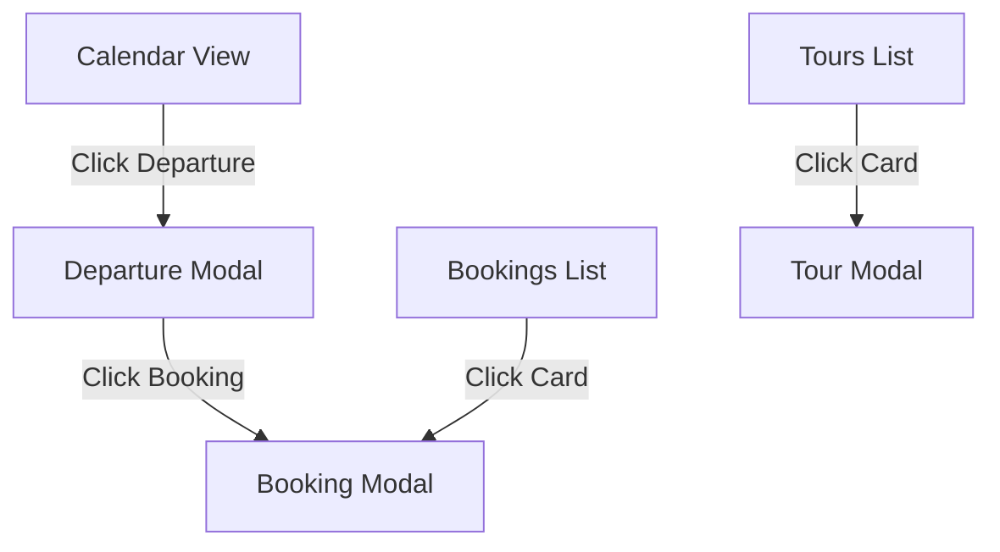
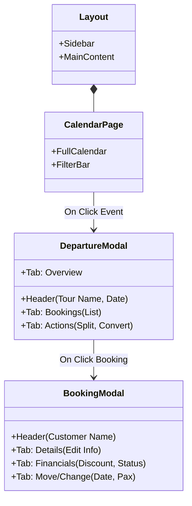

# Admin Dashboard Design Plan

> [!NOTE]
> **Objective**: Create a premium, high-performance Admin Dashboard for Nevado Trek.
> **Key Principles**: "Wow" Aesthetics, Fluid Animations, Modal-First Architecture, Departure-Centric Workflow.

## 1. Technology Stack (The "Premium" Feel)

To achieve the requested "incredible icons and effects", we will use:

-   **Core**: `React` + `Vite` (Fastest dev experience).
-   **Styling**: `Tailwind CSS` (Utility-first) + `Glassmorphism` tokens.
-   **Animations**: `Framer Motion` (For smooth layout transitions, modal entries, and hover effects).
-   **Icons**: `Lucide React` (Clean, modern, consistent).
-   **State/Data**: `TanStack Query` (React Query) - Critical for syncing with the backend without manual fetch management.
-   **Calendar**: `FullCalendar` or `React-Big-Calendar` (Google Calendar style).
-   **Forms**: `React Hook Form` + `Zod` (Strict validation matching our backend).

---

## 2. UX/UI Architecture

### The Layout: "Glass Command Center"
-   **Sidebar**:
    -   Collapsible (Width transition).
    -   Glassmorphism background (Blur effect).
    -   Active state: Glowing accent indicator.
    -   **Items**: Dashboard (Calendar), Bookings, Departures, Tours, Stats.
-   **Main Area**:
    -   Subtle gradient background (Dark/Light mode compatible).
    -   Floating cards with soft shadows.

### The "Modal-First" Strategy
Instead of navigating away and losing context, we use **Stacked Modals** or **Panel Overlays**.

---

## 3. Detailed View Breakdown

### A. Login (The Gatekeeper)
-   **Visual**: Minimalist, centered card on a blurred nature background.
-   **Input**: Single field for `X-Admin-Secret-Key`.
-   **Effect**: On success, the card "expands" to fill the screen, revealing the dashboard.

### B. The Calendar (Dashboard)
-   **Visual**: Large, full-screen calendar.
-   **Data**: Displays `Departures`.
-   **Color Coding**:
    -   🟢 Public (Open)
    -   🔵 Private
    -   🔴 Full/Closed
-   **Interactions**:
    -   **Hover**: Tooltip with `Tour Name`, `Pax: 4/8`, `Status`.
    -   **Click**: Opens **Departure Modal**.

### C. Departure Modal (The Hub)
A rich modal with Tabs to manage the specific trip.

| Tab | Content & Actions | Backend Endpoint |
| :-- | :-- | :-- |
| **Overview** | Date, Tour, Type, Status, Capacity Bar.   *Actions*: Edit Date, Change MaxPax. | `PUT /admin/departures/:id` |
| **Bookings** | List of linked bookings (Cards).   *Actions*: Click to open Booking Modal, "Add Booking Here". | `GET /admin/departures` (derived) |
| **Tools** | "Split Departure" (Move booking to new private), "Convert Type". | `POST /split`, `POST /convert-type` |
| **Danger** | Delete Departure (if empty). | `DELETE /admin/departures/:id` |

### D. Booking Modal (The Detail)
Invoked from the Bookings List OR the Departure Modal.

| Tab | Content & Actions | Backend Endpoint |
| :-- | :-- | :-- |
| **Guest** | Name, Email, Phone, Doc, Note.   *Actions*: Edit Details. | `PUT /details` |
| **Itinerary** | Current Tour/Date.   *Actions*: **Move Booking** (Date/Tour change). | `POST /move` |
| **Financials** | Price breakdown, Payment Status.   *Actions*: **Apply Discount**, Change Status (Paid). | `POST /discount`, `PUT /status` |
| **Pax** | Passenger Count.   *Actions*: +/- Pax (Auto-recalc price). | `PUT /pax` |
| **Danger** | Cancel Booking. | `PUT /status` (Cancelled) |

### E. Bookings Page
-   **Layout**: Grid of "Ticket-style" cards.
-   **Filters**: Search by Name, Filter by Status, Filter by Tour.
-   **Create Button**: Floating Action Button (FAB) -> Opens "Wizard" to create booking (Select Tour -> Select Date -> Enter Pax -> Enter Guest).

### F. Tours Page (Catalog)
-   **Layout**: Masonry grid of Tour Cards with large images.
-   **Card Info**: Name (ES/EN), Base Price, Active Status.
-   **Modal**: Full form to edit all fields (including the new `faqs`, `itinerary`, etc.).

---

## 4. Implementation Roadmap

### Phase 1: Skeleton & Auth
1.  Initialize Vite Project (`admin-dashboard`).
2.  Setup Tailwind & Framer Motion.
3.  Create `AuthContext` (Store Key in LocalStorage).
4.  Create `ApiClient` (Axios interceptor).

### Phase 2: Core Components
5.  Build `Sidebar` and `Layout`.
6.  Build `Modal` System (Headless UI).
7.  Build `Tabs` Component.

### Phase 3: Feature Implementation
8.  **Tours**: CRUD + New Fields Form.
9.  **Departures**: Calendar View + Create/Edit.
10. **Bookings**: List View + Create Wizard.

### Phase 4: The "Wow" Factor
11. **Interactions**: Connect Modals (Departure -> Booking).
12. **Polish**: Add loading skeletons, toast notifications (Success/Error), and hover effects.

---

## 5. Visual Structure (Mockup Logic)

